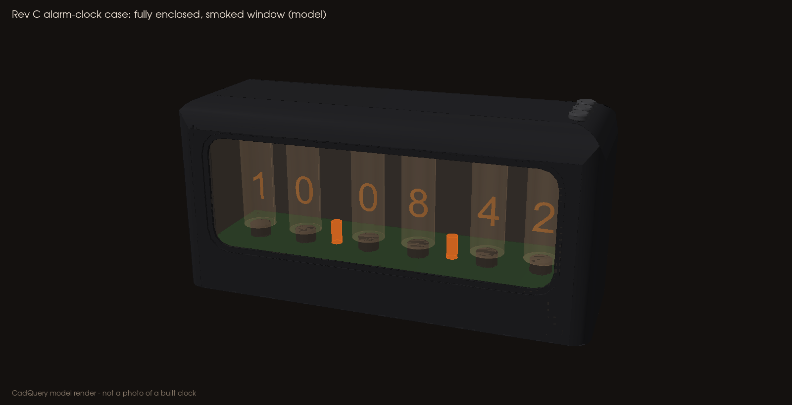
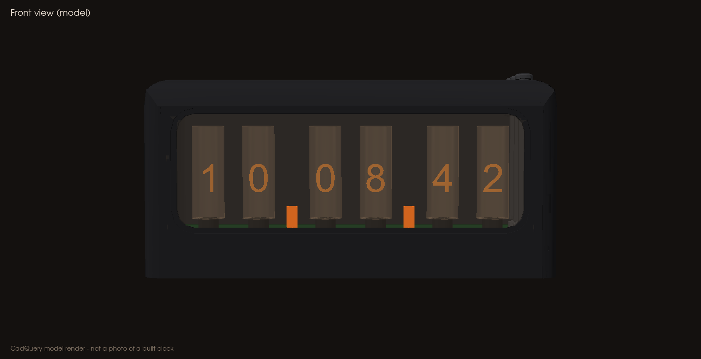
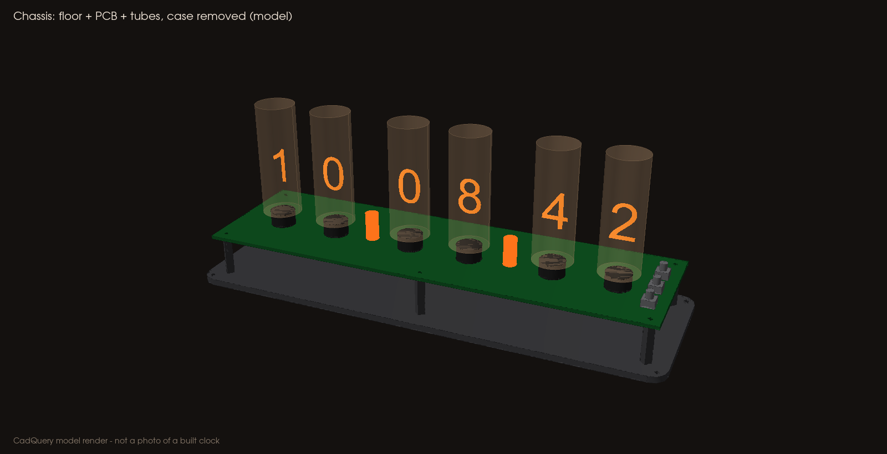
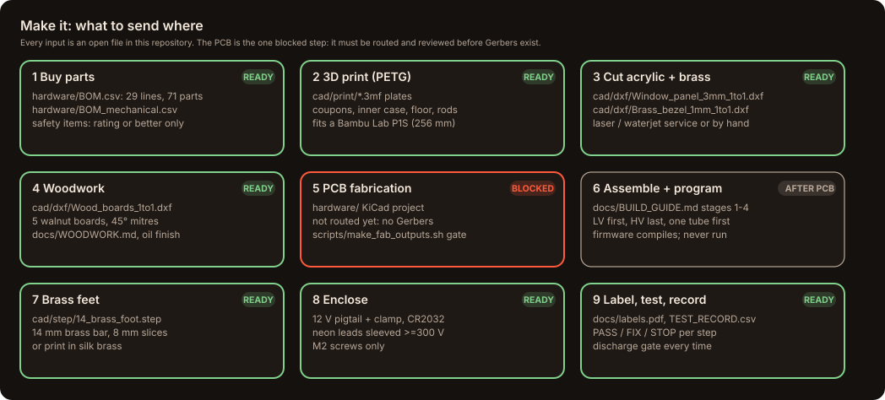
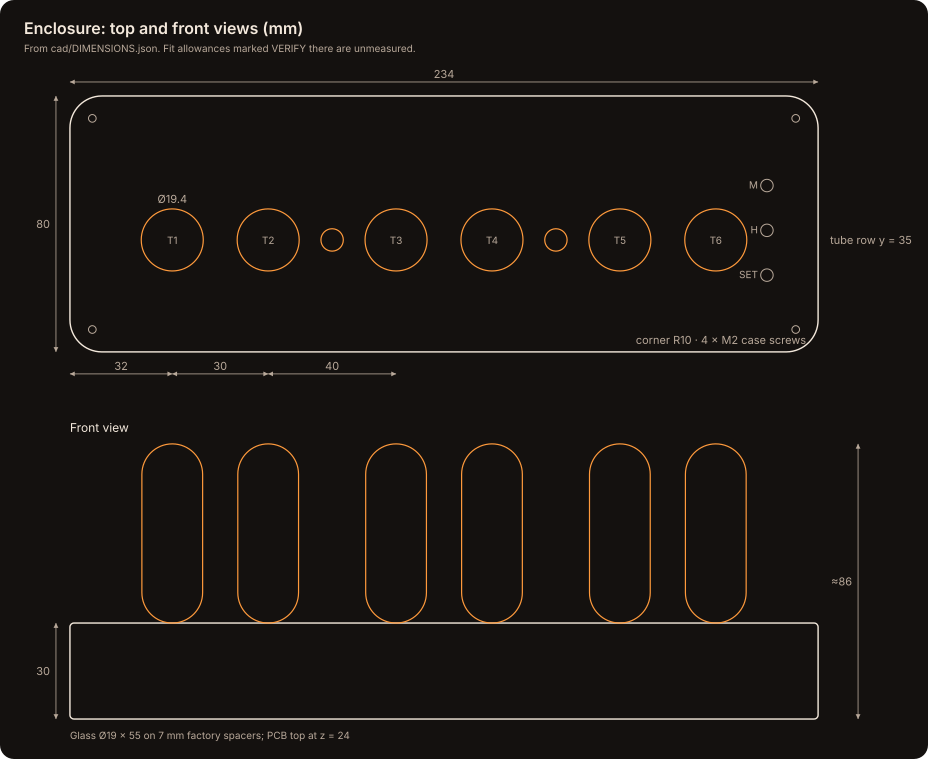
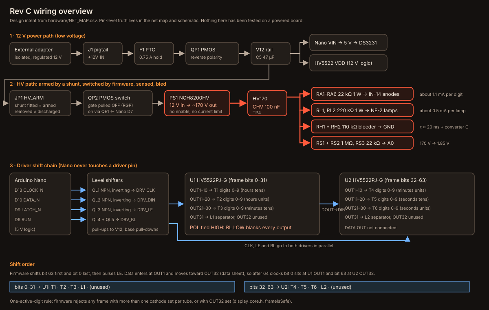
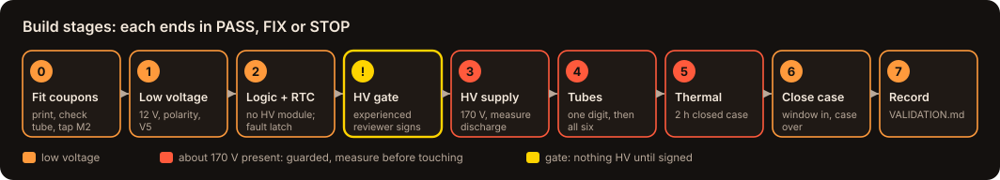

# Six-Tube Nixie Clock · Rev C

> [!CAUTION]
> **About 170 V of direct current (DC) inside: hazardous and potentially lethal.** Power only from an external, isolated 12 V adapter (no mains inside). Dark tubes, software "off" or a pulled shunt do **not** mean safe: **measure test pad TP4 below 10 V** before touching. Read **[SAFETY.md](docs/SAFETY.md)** first.

**An open-source alarm-clock-style clock with six real IN-14 Nixie tubes, fully enclosed behind a smoked window, that you can make yourself.** It comes with a 3D-printable enclosure, a laser-cut top, a bill of materials (BOM), pin-by-pin wiring, KiCad files, firmware, requirements, labels and a staged build guide, plus a website and a desktop app. **The one missing piece is a routed circuit board**: the path to it is in [MANUFACTURING.md](docs/MANUFACTURING.md).

   



| Front | Inside (case lifted off) |
|---|---|
|  |  |

> [!IMPORTANT]
> **Rev C is an unvalidated engineering prototype.** Nothing has been powered yet, and the circuit board is not routed, so no Gerber files exist. Recorded file checks pass; every physical check is still open ([VALIDATION.md](docs/VALIDATION.md)).

## At a glance

| | |
|---|---|
| 📏 **Size** | 234 × 80 × 112 mm, about 116 mm to the top of the buttons |
| 🔆 **Display** | 6 × IN-14 tubes (HH MM SS) + 2 × NE-2 neon separators |
| 🔌 **Power** | External isolated 12 V adapter, about 0.25 A with all digits lit |
| 🧠 **Electronics** | Arduino Nano Classic · DS3231 real-time clock (RTC) · 2 × HV5522 tube drivers · NCH8200HV 170 V module |
| 🧱 **Enclosure** | Fully enclosed alarm-clock case: PETG print (fits a Bambu Lab P1S) · 3 mm smoked cast-acrylic window · SET / H / M buttons on top · **M2 screws only** |
| 💲 **Parts** | About $390 planning estimate before tax (not re-priced for the new case) |

## 🏭 Make it



Full process, PCB specification and the release gate: **[MANUFACTURING.md](docs/MANUFACTURING.md)**.

## 🧊 See it in 3D


**How it goes together:** the window slides up into the case, the PCB with its tubes screws onto the floor (the *chassis*), and the case lowers over it. No glass ever passes through an opening, and nothing high-voltage can be reached once the four floor screws are in.

GitHub shows `.stl` files in an interactive 3D viewer: click one to rotate it.

| View the whole clock (do not print) | Print these (PETG) | Cut this |
|---|---|---|
| [Whole clock](cad/view/Assembly_RevC_alarm_clock_VIEW_ONLY.stl) · [Chassis, case off](cad/view/Chassis_RevC_case_removed_VIEW_ONLY.stl) | [01 case](cad/stl/01_alarm_case_shell.stl) · [02 floor](cad/stl/02_floor.stl) · [03 clamp](cad/stl/03_cable_clamp.stl) · [04 button rod ×3](cad/stl/04_button_rod.stl) · [06 fit coupon](cad/stl/06_fit_coupon.stl) · [07 lead coupon](cad/stl/07_unpowered_lead_pattern_coupon.stl) · ready plates in [`cad/print/`](cad/print/) | [Window panel DXF](cad/Window_panel_3mm_1to1.dxf) (3 mm smoked cast acrylic, 1:1) |

STEP files for computer-aided design (CAD) are in [`cad/step/`](cad/step/); the model of record is [`source/build_cad.py`](source/build_cad.py), driven by [`cad/DIMENSIONS.json`](cad/DIMENSIONS.json). Printing settings: [PRINTING.md](docs/PRINTING.md).



## 🧾 Bill of materials

29 electrical lines (71 parts) plus enclosure and fasteners. **Lines marked safety-critical must be bought at the stated rating or better.**

| Key part | Qty | Why it matters |
|---|---|---|
| IN-14 Nixie tube | 6 | The display; enclosure is sized for it |
| HV5522PJ-G driver (PLCC-44) | 2 | Switches the tube cathodes (not the PG package) |
| NCH8200HV module | 1 | Makes about 170 V from 12 V |
| Arduino Nano Classic + DS3231SN# | 1 + 1 | Brains and timekeeping |
| 22 kΩ 1 W resistors (Vishay PR01) | 6 | Tube current limit: **safety item** |
| 100 nF ≥250 V capacitor, 110 kΩ bleeders | 1 + 2 | HV rail storage and discharge: **safety items** |

Everything, with specs and allowed substitutions: [`hardware/BOM.csv`](hardware/BOM.csv) · [`hardware/BOM_mechanical.csv`](hardware/BOM_mechanical.csv) · readable [BOM.md](docs/BOM.md).

## 🔌 Circuit and wiring



- **Pin by pin:** [WIRING.md](docs/WIRING.md) and [`hardware/NET_MAP.csv`](hardware/NET_MAP.csv) (340 connections; HV5522 pins from the data sheet)
- **Schematic:** [PDF](docs/Nixie_RevC_schematic.pdf) · KiCad project in [`hardware/`](hardware/)
- **PCB:** [mechanical drawing](docs/img/pcb_drawing.svg) · placement-only board (checked by KiCad's own design rules check, no copper yet)
- **Numbers behind the design:** [EQUATIONS.md](docs/EQUATIONS.md) (tube current, resistor power, discharge time, RTC drift)

## 🛠️ Build it



Step by step, with parts, measurements and PASS / FIX / STOP at every stage: **[BUILD_GUIDE.md](docs/BUILD_GUIDE.md)**. Record each unit in [`hardware/TEST_RECORD.csv`](hardware/TEST_RECORD.csv) and stick on the [labels](docs/labels.pdf).

## ✅ Requirements


40 requirements, each traced to the part of the design that meets it and to how it is verified: [REQUIREMENTS.md](docs/REQUIREMENTS.md).

## 💻 Website, app and tools

| Website | Desktop app | Tools |
|---|---|---|
| This repository as a website on GitHub Pages; installs as an offline web app | Windows, macOS and Linux from the *Releases* page | Tube and HV calculator, and a USB serial companion for the clock ([APP.md](docs/APP.md)) |

## 🚀 Publish and keep building

- Put this repository on GitHub (website and desktop release included) with one paste: [PUBLISH.md](docs/PUBLISH.md)
- Everyday commands (check, commit, release, apply a new ZIP): [DEVELOP.md](docs/DEVELOP.md)
- Supply chain, signed releases, reporting problems: [SECURITY.md](docs/SECURITY.md) · data sheets: [CREDITS.md](CREDITS.md)

<details>
<summary><b>Repository layout</b></summary>

```
README.md            this page
docs/                SAFETY · BUILD_GUIDE · MANUFACTURING · BOM · WIRING · REQUIREMENTS · EQUATIONS
                     PRINTING · VALIDATION · APP · PUBLISH · DEVELOP · SECURITY · labels.pdf · schematic PDF
hardware/            KiCad project · NET_MAP.csv · BOM.csv · BOM_mechanical.csv · REQUIREMENTS.csv
                     COMPONENT_PLACEMENT.csv · TEST_RECORD.csv · REVIEW_SIGNOFF.md · native-check reports
firmware/Nixie_RevC/ Nixie_RevC.ino · display_core.h · build/Nixie_RevC.hex
cad/                 DIMENSIONS.json · stl/ · 3mf/ · print/ · step/ · view/ · window DXF · assembly STEP
source/build_cad.py  CadQuery model of record
scripts/             generators, checks, publish/ship/release helpers, gated fab-output script
tests/               equation, design, requirement, CAD and firmware checks
site/ · app/         GitHub Pages website · Electron desktop app
sbom/                toolchain software bill of materials
```
</details>

**Checks:** `scripts/run_all_checks.sh` reruns every recorded check (equations, design tables, requirements, firmware, AVR compile, CAD geometry, KiCad netlist and placement checks). Passing means the files agree with each other, not that a powered clock works.

**License:** MIT ([LICENSE](LICENSE)). Building and powering high-voltage hardware is at your own risk.
