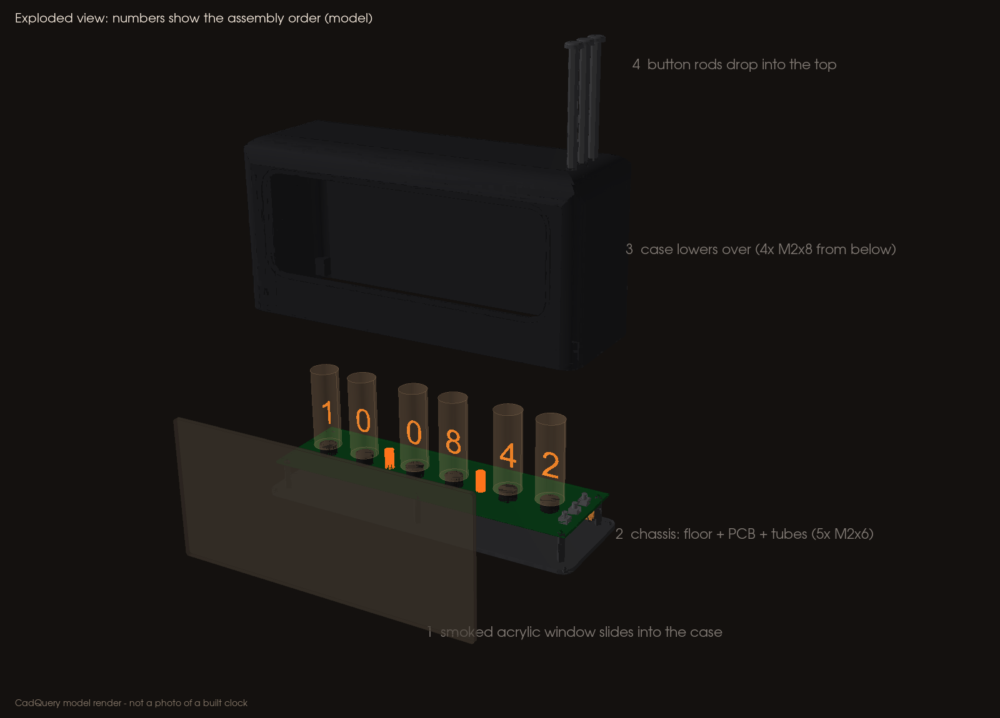

# Build guide (Rev C)

This is the spine of the project. Every stage lists the **parts**, the **steps**, the **measurements** to record, and an explicit **PASS / FIX / STOP** decision. Record every measurement in [VALIDATION.md](VALIDATION.md) as you go; that file is how the next builder learns what actually worked.

> **Read [SAFETY.md](SAFETY.md) first.** Stages 3 onward involve about 170 V DC. There is a safety gate before anything high-voltage, and the discharge gate is never skipped.

**Words used here.** *HV* = high voltage, the ~170 V rail (`HV170`). *LV* = low voltage, the 12 V and 5 V parts. *Shunt* = the little jumper cap on JP1 (HV_ARM). *RTC* = real-time clock (the DS3231). *PCB* = printed circuit board. *DMM* = digital multimeter. *IDE* = integrated development environment (the Arduino app). *USB* = Universal Serial Bus. *I²C* = Inter-Integrated Circuit, the two-wire bus to the RTC. *VIN* = the Nano's input-voltage pin. *CAT II* = the meter's measurement category rating. *PETG* = polyethylene terephthalate glycol, the printing plastic.

## Before you start: what exists and what does not

Rev C is an **unvalidated engineering prototype**. The repository has the net map, a generated KiCad schematic, a placement-only board, firmware and enclosure models. It does **not** yet have a routed board or Gerber files. Someone must:

1. Open `hardware/Nixie_RevC.kicad_pro` in KiCad, redraw the generated schematic into readable form, pick or draw real footprints, and run **native ERC** (electrical rules check).
2. Route the 4-layer board with the HV rules in `hardware/Nixie_RevC.kicad_dru` and run **native DRC** (design rules check).
3. Have the HV layout reviewed by someone experienced, then generate Gerbers and drill files.

Only after that does Stage 1 have a board to populate. Stages 0 and the firmware parts of Stage 2 can be done today.

**Tools:** temperature-controlled soldering iron, flux, DMM rated CAT II 600 V or better with clip leads, bench supply with adjustable current limit (for Stages 1–3), USB Mini-B data cable, M2 tap and holder, calipers, safety glasses.

**The enclosure** is a fully enclosed alarm-clock case: the tubes stand inside, seen through a smoked acrylic window, and SET, H and M are pressed from the top. The PCB screws onto five standoffs on the printed floor, making a **chassis** you can work on by itself; the case lowers over it at the end. One fastener set: 4 × M2 × 8 and 7 × M2 × 6 ([BOM.md](BOM.md#m2-fasteners-one-set)).

---

## Stage 0: fit coupons and M2 threads (no electronics)

**Parts:** PETG, `cad/print/plate_0_fit_coupons.3mf` (parts 06 and 07), one IN-14 tube, one printed button rod (part 04), a 25 mm offcut of your 3 mm acrylic, a scrap of 1.6 mm board, M2 × 6 and M2 × 8 screws, M2 tap.

**Steps**
1. Print the coupons with the baseline settings in [PRINTING.md](PRINTING.md).
2. Coupon 06: slide the acrylic offcut into the 3.3 mm slot (it must go in without force and not rattle), and slide a button rod through the guide (it must drop freely under its own weight).
3. Tap the two 1.7 mm pilot holes with an M2 tap, backing out every half-turn. Drive an M2 × 6 through the board scrap into the standoff, and an M2 × 8 into the tall block. Snug, then back out.
4. Coupon 07 (**never powered**, never used as a tube spacer): try your tube's 13 leads against the hole pattern. The pattern in `cad/DIMENSIONS.json` (13 × Ø1.0 mm on a 12.0 mm circle) is a placeholder; measure your tube's actual lead circle with calipers and update `in14_lead_circle_d`.

**Measure:** glass diameter and height of each of your six tubes (spacer plus glass must stay under 80 mm above the board; nominal is 62 mm); acrylic thickness; thread engagement (turns before snug); the real lead circle diameter.

- **PASS:** acrylic slides in, rod drops freely, screws bite firmly and do not strip.
- **FIX:** a tight hole → change the value in `cad/DIMENSIONS.json` and rerun `scripts/render_cad`. **Never scale a whole part** in the slicer to fix a hole. Stripped threads → try 1.6 mm pilots.
- **STOP:** your tubes are taller than the case allows (they would touch the roof).

---

## Stage 1: low-voltage section (no HV parts powered)

**Parts:** the bare Rev C PCB, F1, QP1, C5, C1–C4, U1, U2, U3 and its passives, all level-shifter parts (QL1–QL5, RB1–RB4, RB6, RPD1–RPD4, RC1–RC3, RD1, RPU5), the HV-enable parts that are still low voltage (QE1, RB5, RPD5, QP2, RGP, C6, the JP1 header), RV1, RV2, RI1, RI2, C7, C8, Nano headers, J1 pigtail, J2 battery holder.

**Do not fit yet:** PS1, the JP1 shunt, tubes, lamps, anode and lamp resistors, bleeders, sense divider (RS1–RS3), CHV.

**Steps**
1. Inspect the bare board under magnification: no bridges, no copper slivers near the HV area.
2. Solder surface-mount parts smallest first, then the Nano headers and the pigtail. Clamp the pigtail so it does not pull on the pads.
3. Clean off flux. Inspect every joint.
4. With nothing powered, measure resistance TP2 → TP1 and TP3 → TP1. Neither should be a short.
5. Bench supply at 12.0 V, **current limit 100 mA**, into J1. Nano **not** plugged in yet.

**Measure:** TP2 (V12), supply current; then reverse the leads briefly and confirm almost zero current (QP1 blocking).

- **PASS:** TP2 = 11.8–12.0 V, current a few milliamps; reversed polarity draws nothing and nothing warms.
- **FIX:** low V12 → check QP1 orientation and F1. Current at the limit → look for a short near C5/C6 or the drivers.
- **STOP:** anything gets hot, or the supply sits in current limit.

Then plug in the Nano (not yet programmed) and repeat: TP3 (V5) should be 4.9–5.1 V.

---

## Stage 2: logic and RTC bring-up (no converter fitted)

**Parts:** Nano on its headers, CR2032 in its holder, USB data cable, the JP1 shunt. PS1 is **not** fitted yet, so nothing on the board can make high voltage in this stage. That is why the shunt can go in here: it lets you test the HV switch QP2 with nothing behind it.

**Steps**
1. Install the Arduino IDE and "Arduino AVR Boards". Board: *Arduino Nano*; processor: *ATmega328P* (try *Old Bootloader* if upload fails). Open `firmware/Nixie_RevC/Nixie_RevC.ino` and upload. Record the IDE, core and compiler versions in VALIDATION.md.
2. Serial monitor at 115200 baud, line ending *Newline*. You should see `Nixie Rev C (UNVALIDATED PROTOTYPE FIRMWARE)` and `RTC time invalid ... display stays OFF`.
3. Type `T 12:34:00`. Expect `OK time set`. Type `STATUS`.
4. Fit the shunt. Apply 12 V (bench supply, 150 mA limit). With a valid time the firmware switches QP2 on, sees no high voltage (PS1 is not fitted) and reports `HV did not reach 150 V ...` and `HV FAULT latched in EEPROM`. **That is the expected result**: it proves the start check works. Press the Nano's reset button: it must print `HV FAULT is latched from before the reset` and keep HV off. Then send `HVOFF` followed by `CLEARFAULT` (in that order, so it does not immediately try again).
5. Buttons: `STATUS` shows `buttons SET/H/M 000`; hold each switch and repeat, expecting a `1` in its place.
6. Battery backup: note the time, remove 12 V and USB for five minutes, restore power, `STATUS`. Time must have kept running.
7. HV switch check (shunt fitted, 12 V on): hold the Nano in reset (keep its reset button pressed) and measure `HV_IN_12V` (QP2 drain, the PS1 VIN pad): it must be about 0 V, and `HV_GATE` must equal `HV_ARMED_12V` (about 12 V). With `HVOFF` in force, `HV_IN_12V` must again be about 0 V. Send `RUN` only when you want HV requested again.
8. Logic check with a scope or logic analyser (optional, recommended): probe `DRV_CLK`, `DRV_DIN`, `DRV_LE` and `DRV_BL` at the drivers. Swings should be about 0 V to 12 V. With the Nano held in reset, `DRV_BL` must read LOW.
9. Remove the shunt again before Stage 3.

**Measure:** VIN reading in `STATUS` vs DMM on TP2; backup result; `HV_IN_12V` in reset and after `HVOFF`; `HV_IN_12V` during the start attempt (about 12 V); driver-side logic levels; `DRV_BL` during reset.

- **PASS:** time set and retained, buttons read, fault survives a reset until `CLEARFAULT`, `HV_IN_12V` about 0 V whenever HV is not requested, `DRV_BL` LOW in reset, logic swings 0–12 V.
- **FIX:** `RTC read failed` → check I²C pull-ups and U3 orientation. Wrong VIN reading → check RV1/RV2.
- **STOP:** `DRV_BL` is HIGH while the Nano is in reset, `HV_IN_12V` is above about 1 V when HV is not requested, or a fault does not survive a reset. The blanking, HV-enable or fault-latch default is broken; do not continue to Stage 3.

---

## SAFETY GATE before Stage 3

All of these must be true. Write the date and the reviewer's name in VALIDATION.md.

- [ ] Stages 0–2 passed and are recorded.
- [ ] An experienced HV reviewer has inspected the populated board, the HV area, the planned test setup and this guide.
- [ ] Meter: CAT II 600 V or better, black lead clipped to TP1, discharge tool (≥10 kΩ, ≥5 W, insulated) within reach.
- [ ] Bench supply with current limit available; the board sits on an insulated surface behind a clear barrier; meter leads and USB are connected before power; no one else touches it.
- [ ] You will not leave it energised unattended, and you know the stop conditions in [SAFETY.md](SAFETY.md#stop-conditions-any-of-these-ends-the-session-until-fixed).

---

## Stage 3: HV stage (guarded)

**Parts:** PS1 NCH8200HV, CHV, RH1, RH2, RS1, RS2, RS3. **Still no tubes, lamps or anode resistors.**

**Steps**
1. With everything unplugged, fit PS1, CHV, the bleeders and the sense divider. Clean and inspect; check the HV area for flux and solder balls.
2. Screw the board onto the floor standoffs (5 × M2 × 6) so it becomes the chassis. Bench supply 12.0 V, current limit **300 mA**. Guarded bench setup from [SAFETY.md](SAFETY.md) rule 4: chassis without its case, on an insulated surface behind a clear barrier. Connect USB and open the serial monitor, and clip the meter to TP4/TP1, all **before** applying power.
3. Insert the HV_ARM shunt (power off). Apply 12 V. The firmware starts HV if the time is valid. Expect `HV up: ~170 V`.
4. Read TP4 on the meter. Compare with the firmware's `HV sense` in `STATUS`.
5. Send `HVOFF`. Watch the meter fall. The firmware should report `HV decayed to ...` after 3 s.
6. Unplug 12 V. Wait 60 s. Confirm TP4 below 10 V. **This is the discharge gate.**

**Measure:** TP4 running; firmware HV reading; supply current with HV on (no load); TP4 at 1 s, 5 s and 60 s after `HVOFF`; time to fall below 10 V.

- **PASS:** TP4 = 165–175 V; firmware within about 5 % of the meter; TP4 below 10 V within a few seconds and well below by 60 s.
- **FIX:** firmware reading off by a steady percentage → note it; the Nano's 5 V reference is the usual cause.
- **STOP:** TP4 above 190 V; supply in current limit; TP4 not falling after `HVOFF` or not below 10 V at 60 s (suspect RH1/RH2 or the solder joints); any heat or smell at PS1.

---

## Stage 4: light one digit, then all six tubes and both lamps

**Parts:** T1–T6 with factory spacers, RA1–RA6, L1, L2, RL1, RL2, sleeving.

**Steps**
1. Discharge gate (unplug, 60 s, TP4 below 10 V). Remove the shunt.
2. Fit **T1 only** and RA1. This stage uses the same guarded bench setup as Stage 3 (chassis without its case, barrier, leads and USB connected before power). Tubes are direct-solder: keep the factory spacers, seat the tube square, solder the leads, and never bend them at the glass seal.
3. Fit the shunt (power off), then power up. Use `EXERCISE` or set the time so T1 shows each digit. Confirm the digit that lights is the one intended: this is the real test of the bit order, `kOutReversed`, and the latch and clock timing.
4. Measure the current of each digit. Two methods, chosen with your reviewer: (a) with power off and the rail discharged, lift one end of RA1 and clip the DMM in its mA range into the gap before powering up; or (b) clip DMM leads across RA1 before powering up, read the voltage, and divide by 22 kΩ. Never move probes while 12 V is on.
5. Discharge gate. Fit the remaining tubes, anode resistors, lamps (leads sleeved) and lamp resistors. Repeat the digit check for every tube and both separators.
6. With all six tubes lit, record the supply current and TP4.

**Measure:** per-digit current for every digit of every tube (60 values); lamp current; TP4 with all lit; 12 V supply current with all lit.

- **PASS:** each tube shows only the intended digit; currents close to the model (about 0.7–1.6 mA; see [EQUATIONS.md](EQUATIONS.md#1-tube-anode-current)); TP4 stays above 160 V with everything lit; supply current about 0.25 A.
- **FIX:** wrong digit lights → flip `kOutReversed` or correct the cathode wiring, and record which. Digits glow only partly → too little current; discuss changing RA with your reviewer (it raises the fault power) and record the change as a design change.
- **STOP:** two digits in one tube glow together; a separator lights when it should be off; TP4 sags below 150 V (the firmware will fault); anything hot.

---

## Stage 5: closed-case thermal run

**Steps:** close the alarm-clock case completely (no USB: the port is inside), shunt fitted, all digits running, 25 °C room. The case has no vents on purpose (it keeps HV enclosed); the model predicts an average internal rise of only a few kelvin ([EQUATIONS.md](EQUATIONS.md#7-sealed-case-temperature)), and this stage checks the hot spots. Measure the 12 V current with an inline meter on the adapter side. Run for 2 hours, watching the tubes. Then unplug, pass the discharge gate, open, and immediately measure the Nano's regulator, PS1 and the anode resistors with a thermometer or thermal camera. Afterwards, connect USB (shunt out) and read `STATUS` for any fault.

**Measure:** temperatures, 12 V current at start and end, room temperature, time drift, any fault.

- **PASS:** regulator comfortably below its limit (record the value; below about 70 °C case temperature is a reasonable target), no part too hot to touch briefly, HV steady.
- **FIX:** hot regulator → the case may need baffled vents that do **not** expose HV; that is an enclosure design change.
- **STOP:** any component discoloured or the case deformed.

---

## Stage 6: close the alarm-clock case

**Parts:** case (01), window panel (05), three button rods (04), cable clamp (03), clear silicone, four rubber feet, two cable ties.

1. Discharge gate. Dress the pigtail through the rear opening, over the floor's cradle, and fix it with the cable clamp (2 × M2 × 6).
2. Case upside down on a soft cloth: slide the window panel up into its slot from the open bottom, film peeled on the inside face only. Put three small dots of silicone in the slot (both top corners and the middle of the top edge). Let it cure.
3. Drop the three rods into the holes in the top, cap first from outside: they hang by their caps.
4. Fit the HV_ARM shunt (power off). Turn the case upright and lower it **straight down** over the chassis; the tubes go in without touching anything. Watch that each rod lands on its switch.
5. Lay the clock on its back on a cloth and fit 4 × M2 × 8 through the floor into the corner blocks. Stick the feet clear of the screw heads. Peel the outer film.
6. Check: nothing shows through any gap except the glowing digits; each cap clicks its switch and springs back.

- **PASS:** closed, rigid, buttons work, no exposed HV. **STOP:** any gap exposes HV, or a cap stays down.

**To open later:** unplug, wait 60 s, lay the clock on its back, remove the 4 floor screws, stand it up and lift the case straight up. The window and rods stay in the case. Measure TP4 to TP1 (top side, rear edge) below 10 V before touching anything else; the HV_ARM shunt is next to them.

---

## Stage 7: close the loop

1. Fill in VALIDATION.md: every measurement, every deviation, every FIX you made, and who reviewed Stage 3.
2. If you changed a value, update `cad/DIMENSIONS.json` or `scripts/make_design_tables.py`, rerun the generators and tests, and commit.
3. Only claim what you actually measured. "Worked on my bench" is a data point, not a validation.

**Never skip the discharge gate.**
