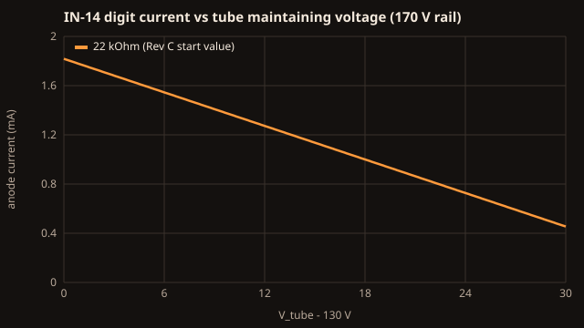
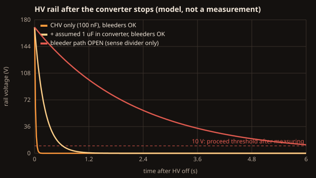

# Equations

Each section goes intuition → equation → symbols and units → worked example → picture and test. Every number on this page is recomputed by [`tests/check_equations.py`](../tests/check_equations.py) (38 checks). They are **model numbers**, not measurements: Stage 4 of the [build guide](BUILD_GUIDE.md) replaces them with readings from your board.

Inputs used throughout:

| Symbol | Value | Source |
|---|---|---|
| V_HV | 170 V | NCH8200HV v2.1 data sheet: fixed nominal output |
| V_tube | 145 V typical, 135–155 V assumed spread | Tube-Tester IN-14 page (typical maintaining voltage) |
| I_typ | 2.5 mA per digit | Tube-Tester IN-14 page (typical cathode current) |
| R_anode | 22 kΩ, 1 W | Rev C start value (RA1–RA6) |
| R_lamp | 220 kΩ, 1 W | RL1, RL2 |
| V_NE2 | 60 V assumed | NE-2 maintaining voltage; **verify** |

## 1. Tube anode current

**Intuition.** A glowing Nixie tube holds its own voltage roughly constant (the *maintaining voltage*). Whatever is left of the supply is dropped across the anode resistor, and that sets the current.

**Equation.** I_anode ≈ (V_HV − V_tube) / R_anode

**Symbols.** I_anode in amperes (A); V_HV and V_tube in volts (V); R_anode in ohms (Ω).

**Worked example.** (170 V − 145 V) / 22 000 Ω = **1.14 mA**. Across the assumed spread: 1.59 mA at 135 V, 0.68 mA at 155 V.

**What it means.** 1.14 mA is about **45 % of the 2.5 mA typical** IN-14 current. Expect the start value to run the tubes gently; a digit that glows only partly is a sign of too little current. The 22 kΩ value is a *starting point, not a verified brightness*. Measure the current on every digit (Stage 4) before you change anything. For reference, 2.5 mA at 145 V would need about 10 kΩ, and a lower resistor raises the fault power in section 2.

**Test.** `anode current @ V_tube=...` and `22 k start value vs IN-14 typical` in `tests/check_equations.py`.

## 2. Resistor power: why the anode resistors are 1 W

**Intuition.** In normal running the resistor only sees the leftover 25 V or so, so it barely warms. In a fault (a tube or cathode path shorted) it can see the whole rail.

**Equation.** P = I² × R in normal running; P = V_HV² / R if the full rail appears across it.

**Symbols.** P in watts (W); I in A; R in Ω; V in V.

**Worked example.**

| Case | Calculation | Result | Share of 1 W rating |
|---|---|---|---|
| Normal, worst tube (135 V) | (1.59 mA)² × 22 kΩ | 55.7 mW | 5.6 % |
| Fault: full rail across RA | 170² / 22 000 | **1.31 W** | **131 %** |
| Lamp resistor, normal | (0.5 mA)² × 220 kΩ | 55 mW | 5.5 % |
| Lamp resistor, fault | 170² / 220 000 | 131 mW | 13 % |

**What it means.** Normal dissipation is tiny. The 1 W rating is there for voltage stress and fault margin, and it is still **not enough** for a sustained hard short, because the NCH8200HV data sheet describes no current limit (up to 30 mA peak output). This is recorded as an open item in [VALIDATION.md](VALIDATION.md#open-items), not hidden. Never reduce the rating.

## 3. Bleeder discharge

**Intuition.** When the converter stops, its output capacitors are still charged. The bleeder resistors drain that charge. The tubes go dark long before the rail is safe, because a tube stops glowing at about 140 V.

**Equation.** V(t) = V_HV × e^(−t/τ), with τ = R × C, so the time to fall to a voltage V is t = τ × ln(V_HV / V).

**Symbols.** τ (tau), the time constant, in seconds (s); R in Ω (the bleeder in parallel with the sense divider); C in farads (F).

**Worked example.** R = 220 kΩ ∥ 2.022 MΩ = 198.4 kΩ.

| Capacitance on the rail | τ | Time to 10 V |
|---|---|---|
| CHV only (100 nF) | 19.8 ms | 56 ms |
| CHV + an **assumed** 1 µF inside the converter | 218 ms | 0.62 s |
| Same, but **the bleeder path open** (RH1 and RH2 are in series, so one open resistor is enough) | 2.2 s | 6.3 s |

**What it means.** On paper the rail empties in under a second. But the converter's internal capacitance is not in its data sheet, and a single open resistor makes it ten times slower. That is why [SAFETY.md](SAFETY.md) asks you to wait 60 seconds **and measure below 10 V** every time.

**Test.** The `tau ...` and `time to 10 V ...` checks. The firmware also warns if its own sense reading is above 10 V three seconds after HV off; that is a hint, not a proof.

## 4. HV and VIN sensing

**Equation.** V_A0 = V_HV × R_S3 / (R_S1 + R_S2 + R_S3); V_A1 = V_IN × R_V2 / (R_V1 + R_V2)

**Worked example.** 170 V × 22 k / 2.022 M = **1.85 V**, about 378 counts on the Nano's 10-bit analog-to-digital converter (ADC) with a 5 V reference, or 0.45 V of HV per count. 12 V × 10 k / 57 k = 2.1 V on A1. Full scale is 459 V for HV and 28.5 V for VIN. If RS3 ever opens, about 82 µA flows into the A0 protection diodes through 2 MΩ, which the pin tolerates.

**What it means.** The firmware window is 150–190 V. The reference is the Nano's 5 V rail, which can be a few percent off, so compare the firmware's `HV sense` with your meter at Stage 3 and note the difference in VALIDATION.md.

## 5. 12 V input current

**Equation.** I_in ≈ P_HV / (η × 12 V) + I_logic, with P_HV = V_HV × (6 × I_anode + 2 × I_lamp + I_bleed + I_sense)

**Worked example.** Worst-case tubes: P_HV ≈ 1.94 W; at η (efficiency) = 86 % and about 50 mA of logic load, **I_in ≈ 0.24 A**. The HV load (10.6 mA) is about 35 % of the converter's 30 mA peak rating.

**Test.** `12 V input current ...` and `NCH8200HV headroom ...`. A reading well above 0.35 A is a stop condition.

## 6. Real-time clock drift

**Intuition.** The DS3231 is a temperature-compensated crystal clock, so it drifts far less than an ordinary watch crystal, but not zero.

**Equation.** drift per day = accuracy (ppm) × 10⁻⁶ × 86 400 s

**Worked example.** At the data sheet's ±2 parts per million (ppm) from 0 to 40 °C: ±0.17 s per day, ±63 s per year at worst. Real parts are usually better. The DS3231 also has an aging register for trimming, which Rev C firmware leaves at zero.

**Test.** `DS3231 worst drift ...`. To measure your clock, set it against a reference, then compare after a week with `STATUS` over the serial port.

## 7. Sealed-case temperature

**Intuition.** The alarm-clock case has no vents (so the HV stays enclosed). All the power the clock uses ends up as heat inside and has to leave through the case surface.

**Equation.** ΔT ≈ P / (h × A)

**Symbols.** ΔT, the average rise of the inside air over the room, in kelvin (K); P, heat released inside, in W; h, the combined natural-convection and radiation coefficient of the outer surface, in W/(m²·K); A, the outer surface area, in m².

**Worked example.** P ≈ 1.94 W / 0.86 (converter) + 7 V × 50 mA (the Nano's regulator) + 0.1 W (logic) ≈ **2.7 W**. A ≈ 2 × (0.234 × 0.112 + 0.080 × 0.112 + 0.234 × 0.080) ≈ 0.108 m². With h = 5 (pessimistic) ΔT ≈ **5 K**; with h = 10 (typical) ΔT ≈ 2.5 K.

**What it means.** On average the inside barely warms. Hot spots are another matter: the Nano's linear regulator and the HV module run hotter than the air around them. Stage 5 of the build guide measures them after two hours closed.

**Test.** `heat dissipated inside the case`, `average internal rise ...`.
