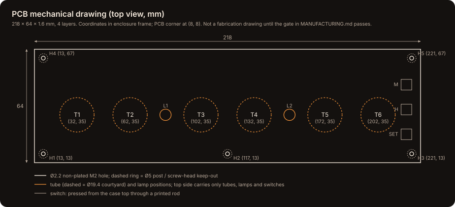
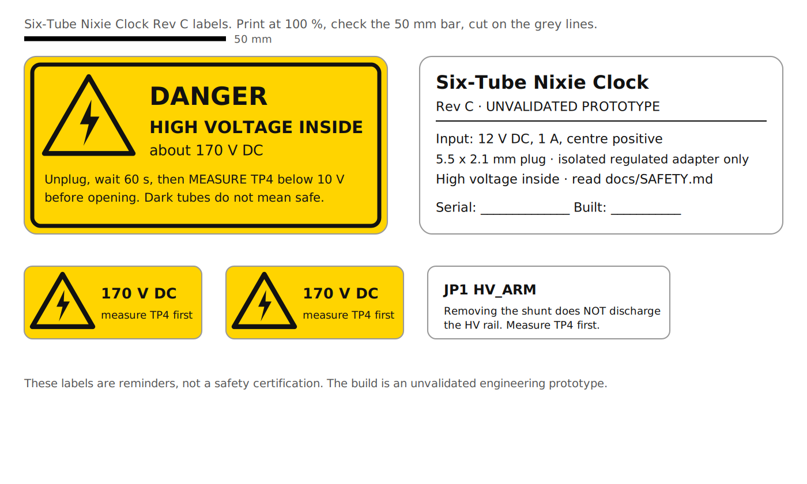

# Manufacturing package (Rev C)

Everything needed to make a Rev C clock from open files, in the order you would do it. **One step is blocked:** the printed circuit board (PCB) has not been routed yet, so there are no Gerber files. Everything else can be made today.


| Process | Files | Status |
|---|---|---|
| Buy parts | [`hardware/BOM.csv`](../hardware/BOM.csv) (electrical, 29 lines, 71 parts) · [`hardware/BOM_mechanical.csv`](../hardware/BOM_mechanical.csv) · readable version: [BOM.md](BOM.md) | Ready |
| 3D print | `cad/print/*.3mf` plates, or single parts in `cad/stl/` and `cad/3mf/` · [PRINTING.md](PRINTING.md) | Ready (fit unverified: print coupons first) |
| Laser cut | [`cad/Acrylic_top_3mm_1to1.dxf`](../cad/Acrylic_top_3mm_1to1.dxf), 3 mm clear cast acrylic | Ready (clear-top option only) |
| PCB fabrication | `hardware/` KiCad project → `scripts/make_fab_outputs.sh` | **Blocked**: board not routed; release gate below |
| PCB assembly | [BUILD_GUIDE.md](BUILD_GUIDE.md) Stages 1–4, `hardware/COMPONENT_PLACEMENT.csv` | Waits for the PCB |
| Wiring | Section 4 below, [WIRING.md](WIRING.md) | Ready |
| Firmware | `firmware/Nixie_RevC/build/Nixie_RevC.hex` or the `.ino` | Compiles (never run on a board) |
| Labels | [`docs/labels.pdf`](labels.pdf) (print at 100 %) | Ready |
| Test and record | [`hardware/TEST_RECORD.csv`](../hardware/TEST_RECORD.csv), [VALIDATION.md](VALIDATION.md) | Ready |

## 1. Buy parts

- Use `hardware/BOM.csv`. The `spec` column is the requirement; `substitution` says when a generic part is fine. **Lines marked `safety_critical = yes` must be bought at the stated rating or better**: the 1 W anode and lamp resistors, the ≥250 V high-voltage capacitor (CHV), the ≥200 V bleeder and sense resistors, the fuse, the P-channel transistors, the HV5522 drivers and the HV module.
- `hardware/BOM_mechanical.csv` lists the enclosure, fasteners and off-board items, with an `option` column: buy `both` plus **one** of `all_printed` or `clear_top`.
- Buy integrated circuits from authorised distributors; buy tubes from sellers who test them.

## 2. 3D print and laser cut

- Bambu Lab P1S (256 × 256 mm bed) or any printer with at least 240 × 85 mm of usable bed: the hood and frame are 234 × 80 mm.
- PETG, 0.20 mm layers, 4 walls, 5 top and bottom layers, 20–25 % infill. Only the clear-top frame needs painted supports (under its five PCB bosses and four upper corner blocks).
- Print `plate_0_fit_coupons.3mf` first and check it against a real tube, switch and M2 screw before printing anything large.
- Acrylic: cut the DXF at 1:1 in millimetres from 3 mm **cast** acrylic; confirm 228.8 × 74.8 mm in the laser software first.


## 3. PCB fabrication (blocked until the release gate passes)

### What exists now

- Generated schematic (root sheet plus two driver sheets), checked net by net against `NET_MAP.csv` with KiCad's own netlist export.
- A placement-only board: 218 × 64 mm outline, five M2 holes and component courtyards, with 0 violations in KiCad's own design rules check (DRC). It has **no copper and no real footprints**.



### What must happen before anyone orders boards

1. Replace the placeholder footprints with real ones, including the IN-14 lead pattern **measured from your tubes** and the NCH8200HV outline **measured from your module**.
2. Run KiCad's electrical rules check (ERC) on a readable schematic.
3. Route four layers with `hardware/Nixie_RevC.kicad_dru` and run DRC to 0 violations and 0 unconnected items.
4. Have an experienced high-voltage reviewer check the layout, then fill in [`hardware/REVIEW_SIGNOFF.md`](../hardware/REVIEW_SIGNOFF.md).
5. Run `scripts/make_fab_outputs.sh`. It checks all of the above and only then writes Gerbers, Excellon drill files, a placement file and the BOM into `fab/`, zipped with a SHA-256 checksum. Today it stops at step 1 on purpose.

### Board specification to send with the files (starting values: confirm with your fab)

| Item | Value |
|---|---|
| Size | 218 × 64 mm, 5 × Ø2.2 mm non-plated M2 holes (see drawing) |
| Layers | 4 |
| Thickness | 1.6 mm FR-4 (glass-epoxy), Tg ≥ 150 °C |
| Copper | 1 oz outer, 0.5 oz inner |
| Finish | ENIG (electroless nickel immersion gold): flat pads suit the 44-lead plastic leaded chip carrier (PLCC-44) drivers |
| Solder mask / silkscreen | Matte black or green / white |
| HV clearance | ≥1.0 mm between HV and low-voltage nets on every layer, ≥0.65 mm HV to HV, ≥2.0 mm HV to board edge (from `Nixie_RevC.kicad_dru`; check against IPC-2221B) |
| Top side | Only tubes, lamps and switches; keep the 21.8 mm baffle rings around each tube clear |
| Electrical test | Request 100 % flying-probe test |

## 4. Wiring harness

| Wire | Spec | Route |
|---|---|---|
| 12 V input | Insulated pigtail, 5.5 × 2.1 mm female, about 150 mm, about 4 mm outer diameter | Rear 4.2 mm hole → floor cradle → cable clamp (part 03, 2 × M2 × 6) → J1 pads |
| Backup cell | Insulated CR2032 holder with leads | J2 pads; stick the holder to the floor away from the HV area |
| Neon lamps | NE-2 leads, sleeved ≥300 V (600 V preferred) over every exposed millimetre | L1, L2 positions |
| Dressing | 2 small cable ties | Keep every low-voltage wire away from PS1, the anode resistors and the tube leads |

## 5. Assembly

Follow [BUILD_GUIDE.md](BUILD_GUIDE.md) exactly. It is also the assembly procedure: low-voltage parts and the HV-enable switch first (Stage 1), logic and clock bring-up with no HV module fitted (Stage 2), the HV supply under guarded conditions (Stage 3), then one tube before all six (Stage 4). Never skip the discharge gate.

## 6. Programming

Arduino IDE (integrated development environment): open `firmware/Nixie_RevC/Nixie_RevC.ino`, board *Arduino Nano*, processor *ATmega328P*, Upload.

Or flash the prebuilt image with `avrdude` (no IDE). Check `firmware/Nixie_RevC/build/BUILD_INFO.txt` for its SHA-256 first, and follow the USB rules in [SAFETY.md](SAFETY.md#usb-the-shunt-and-the-serial-monitor):

```bash
sudo apt-get install -y avrdude
avrdude -p m328p -c arduino -P /dev/ttyUSB0 -b 115200 -D -U flash:w:firmware/Nixie_RevC/build/Nixie_RevC.hex:i   # use -b 57600 for the old bootloader
```

## 7. Test, label, record

- Record every unit in a copy of [`hardware/TEST_RECORD.csv`](../hardware/TEST_RECORD.csv) (one file per serial number). Any STOP result ends the build until it is fixed.
- Print [`docs/labels.pdf`](labels.pdf) at 100 % on vinyl sticker paper: the HV warning and rating plate go on the bottom cover, the small 170 V markers inside the case near PS1 and TP4, and the HV_ARM tag next to JP1.



- Fill in [VALIDATION.md](VALIDATION.md). Claim only what you measured.

## 8. Requirements and licence

- Every requirement, what satisfies it and how it is verified: [REQUIREMENTS.md](REQUIREMENTS.md).
- Everything in the repository is under the MIT licence. If you would prefer a licence written for hardware that keeps derivatives open, the CERN Open Hardware Licence (CERN-OHL-S) is the usual choice; changing it is the project owner's decision.
