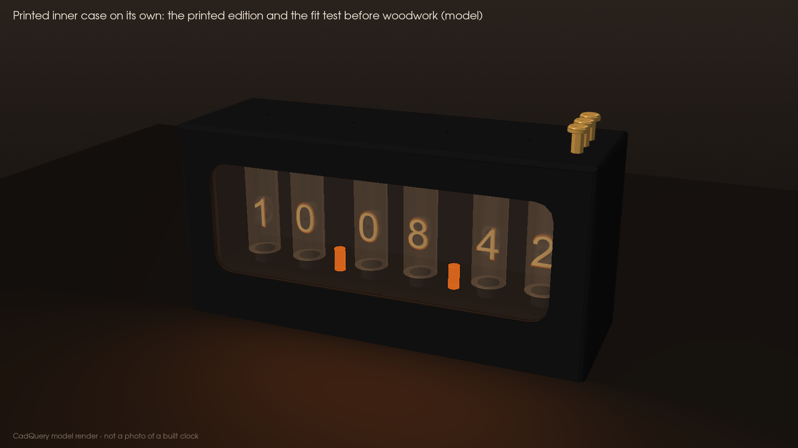
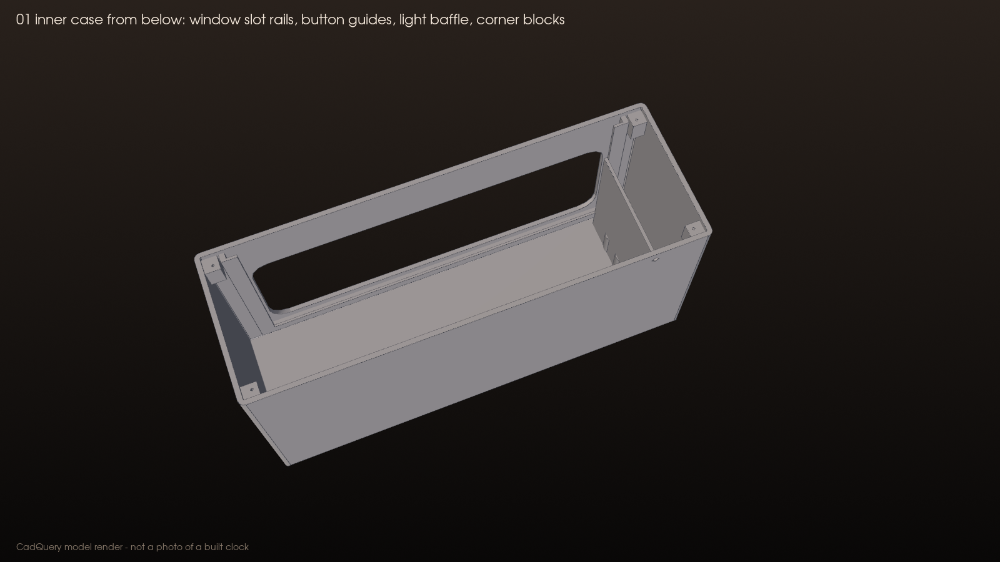

# Printing and cutting

Everything here is a **baseline, untested** starting point. Print the fit coupons first and adjust `cad/DIMENSIONS.json`, not the slicer scale. The wood and brass parts are in [WOODWORK.md](WOODWORK.md).

The printed **inner case** is the real enclosure: it carries the window slot, the button guides, the light baffle and the floor-screw blocks, and it is what keeps the high voltage enclosed. On its own it is a complete, working case (the *printed edition*); the walnut box is cladding that slips over it.

## Which files to use

| Use | Files | Orientation |
|---|---|---|
| **Slice these** | `cad/stl/*.stl` or `cad/3mf/*.3mf`, or the ready plates in `cad/print/` | Print orientation, already on the bed |
| **Laser-cut these** | `cad/dxf/Window_panel_3mm_1to1.dxf` (acrylic) · `cad/dxf/Brass_bezel_1mm_1to1.dxf` (brass) | 2D, 1:1 millimetres |
| **Woodwork** | `cad/dxf/Wood_boards_1to1.dxf` · [WOODWORK.md](WOODWORK.md) | 2D outer faces, 1:1 |
| CAD reference only | `cad/step/*.step`, `cad/Assembly_RevC_heirloom.step` | Assembly coordinates: **do not slice** |
| View only | `cad/view/*.stl` (finished clock, printed edition, chassis) | Includes glass, PCB, wood and brass: **never print** |

## Parts and plates

| Plate | Parts | Notes |
|---|---|---|
| `plate_0_fit_coupons.3mf` | 06 fit coupon, 07 unpowered lead-pattern coupon | Print first, black PETG |
| `plate_A_inner_case.3mf` | 01 inner case (upright, open bottom on the bed) | 234 × 80 × 112 mm, black PETG; tree supports (see below) |
| `plate_B_floor_clamp.3mf` | 02 floor, 03 cable clamp | Black PETG, no supports |
| `plate_C_button_rods_silk_brass.3mf` | 3 × 04 button rods | **Silk brass** (or gold) filament, cap down, 5 mm brim, slow outer walls |
| (single part) | 14 brass foot × 4, only if you are not making them from brass bar | Silk brass, counterbore up |

Coupon 07 carries only the IN-14 lead pattern. **It is never a powered tube spacer.** Keep the factory spacers on your tubes.

Print the inner case in **matte black**: through the smoked window it reads as a dark cavity, so only the glowing digits show.

## Printer

Every printed part fits a Bambu Lab P1S (256 × 256 × 256 mm). Any printer with at least 240 × 85 mm of bed and 115 mm of height works. The wood box (254 × 100 mm) is not printed.

## Baseline settings (PETG, matte)

| Setting | Value |
|---|---|
| Layer height | 0.20 mm |
| Walls | 4 |
| Top / bottom layers | 5 / 5 |
| Infill | 20–25 % (gyroid or grid) |
| Supports | **Inner case (01):** tree supports, automatic, with *on build plate only* turned **off**. They form inside under the roof, the three button guides and the baffle, and in the window opening; the outside needs none. **Everything else:** none |
| Brim | 5 mm on the inner case and the rods |
| Seam | Aligned at the back |

The rods are 96.5 mm tall and 6 mm thick: print them slowly (outer walls about 40 mm/s) with a brim, spaced apart, so they stay straight.

## Inspect in the slicer before printing

- **Window slot:** two vertical rails inside the front wall, a top stop above the window, and a 3.3 mm slot open at the bottom.
- **Button guides:** three tubes hanging from the roof at the right-hand end, with 6.6 mm holes through the top.
- **Light baffle:** a thin fin hanging from the roof just left of the guides; it hides the brass rods from anyone looking in through the window.
- **Roof holes:** four 2.4 mm holes along the middle of the roof for the screws that hold the wood top.
- **Corner blocks:** four solid blocks in the bottom corners, each with a 1.7 mm pilot hole.
- **Floor standoffs:** five 5 mm posts on part 02, 19.4 mm tall, each with a 1.7 mm pilot at the top.
- **Cable path:** the 4.2 mm rear hole, and the cradle and two bosses on the floor.

## After printing

- Tap every 1.7 mm pilot with an M2 tap; clear the chips.
- Check that each rod slides freely in its guide.
- Remove all support material from inside the case, especially around the window slot and the baffle.

## Window panel

Cut `cad/dxf/Window_panel_3mm_1to1.dxf` (layer `CUT`, millimetres, 1:1) from **3 mm cast acrylic**. Smoked grey or bronze gives the vintage look: the glowing digits show through and the rest of the inside disappears. Before cutting, confirm the laser software reads it as 206 × 92.8 mm, and peel the protective film only at assembly.

The panel slides up into its slot from the open bottom of the inner case. Before the case goes on, put three small dots of clear neutral-cure silicone in the slot (both top corners and the middle of the top edge) so the panel stays in the case when you lift the case off later.

## Changing a dimension

1. Edit the value in `cad/DIMENSIONS.json` (for example `window_x`, `button_hole_d` or `wood_fit_gap`).
2. Run `scripts/render_cad`. It rebuilds every STEP, STL, 3MF, plate, DXF, drawing and preview, then runs the geometry checks, so the outputs never drift from the source.
3. Reprint the coupon. Record the change in [VALIDATION.md](VALIDATION.md).

**Never scale a part uniformly to fix a hole.** That moves every screw post too.
