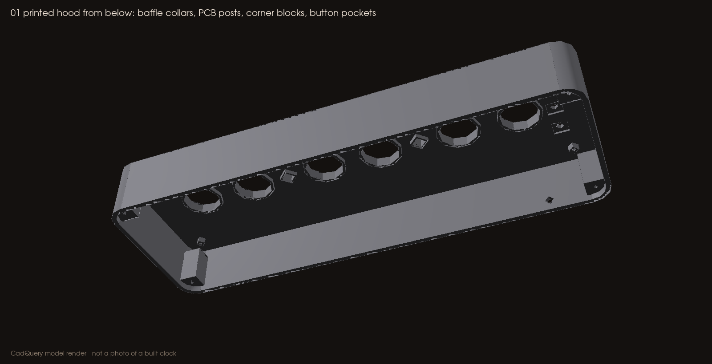
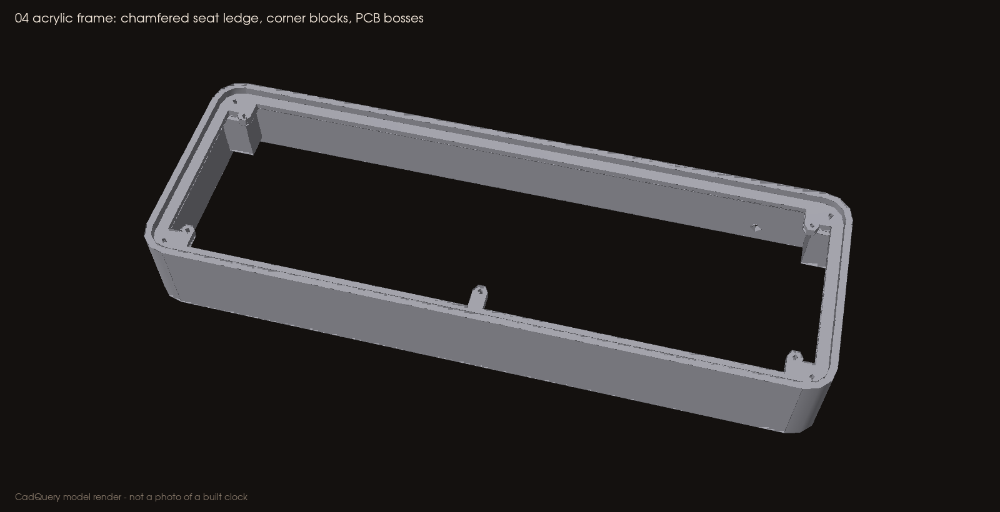

# Printing the enclosure

Everything here is a **baseline, untested** starting point. Print the fit coupons first and adjust `cad/DIMENSIONS.json`, not the slicer scale.

## Which files to slice

| Use | Files | Orientation |
|---|---|---|
| **Slice these** | `cad/stl/*.stl` or `cad/3mf/*.3mf`, or the ready plates in `cad/print/` | Print orientation, already on the bed |
| CAD reference only | `cad/step/*.step`, `cad/Assembly_RevC_*.step` | Assembly coordinates: **do not slice** |
| Never print | `cad/PCB_mechanical_RevC.step` (PCB, glass, spacers, lamps, switches) | Envelopes for fit checks |

**Do not print** any glass, PCB or switch body. **Do not** slice an assembly-coordinate STEP in place of a print-oriented part: the hood, for example, prints upside down.

## Parts and plates

| Plate | Parts | Needed for |
|---|---|---|
| `plate_0_fit_coupons.3mf` | 06 fit coupon, 07 unpowered lead-pattern coupon | Everyone, first |
| `plate_A_all_printed_hood.3mf` | 01 printed hood (upside down: top face on the bed) | All-printed option |
| `plate_B_clear_top_frame.3mf` | 04 acrylic frame (upright) | Clear-top option |
| `plate_C_shared_floor_and_clamp.3mf` | 02 bottom cover, 03 cable clamp | Both options |
| `stl/05_optional_top_plate_3mm.stl` | Printed stand-in for the acrylic top | Only if you cannot get acrylic cut; it will not be clear |

Coupon 07 carries only the IN-14 lead pattern. **It is never a powered tube spacer.** Keep the factory spacers on your tubes.

## Printer bed

The hood and frame are 234 × 80 mm. You need at least about 240 × 85 mm of usable bed. A 220 × 220 mm bed is too small even diagonally.

## Baseline settings (PETG, matte)

| Setting | Value |
|---|---|
| Layer height | 0.20 mm |
| Walls | 4 |
| Top / bottom layers | 5 / 5 |
| Infill | 20–25 % (gyroid or grid) |
| Supports | **Off** for the hood, floor, clamp and coupons. **Frame (04): painted supports** under the five PCB bosses and the four upper corner blocks only |
| Brim | 5 mm on the hood and frame helps long, thin PETG parts stay flat |

## Inspect in the slicer before printing

- **Holes:** the 1.7 mm pilots show as holes in every post, including the blind ones in the hood that stop 1 mm under the visible top.
- **Posts:** the five PCB posts and the four corner blocks are solid, not hollow.
- **Baffles:** the hood's collars around the tube and lamp openings are present; they block line of sight to HV leads.
- **Switch pockets:** three 7.4 mm square pockets on the hood underside.
- **Frame ledge:** the stepped 45° chamfer under the acrylic seat.
- **Cable path:** the 4.2 mm rear opening, and the cradle and two bosses on the floor.

## After printing

- Tap every 1.7 mm pilot with an M2 tap. Clear chips.
- Check the acrylic (or printed plate 05) drops into the frame without force.
- Check each tube opening with a real tube; never force glass.

## Changing a dimension

1. Edit the value in `cad/DIMENSIONS.json` (for example `tube_opening_d`).
2. Run `scripts/render_cad`. It rebuilds every STEP, STL, 3MF, plate, the DXF and the preview images, then runs the geometry checks, so the outputs never drift from the source.
3. Reprint the coupon. Record the change in [VALIDATION.md](VALIDATION.md).

**Never scale a part uniformly to fix a hole.** That moves every screw post too.

## Acrylic top

Cut `cad/Acrylic_top_3mm_1to1.dxf` (layer `CUT`, millimetres, 1:1) from **3 mm clear cast acrylic**. Before cutting, confirm the laser software reads it as 228.8 × 74.8 mm. The tube holes are 19.4 mm, the lamp holes 7 mm, the switch holes 9 mm (to clear the switch bodies), and the four corner screw holes 2.4 mm.
