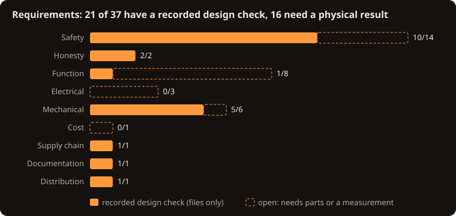

# Requirements (Rev C)

40 requirements, each traced to the design element that satisfies it and to how it is verified. Generated by `scripts/make_requirements.py` (also as [`hardware/REQUIREMENTS.csv`](../hardware/REQUIREMENTS.csv)); `tests/check_requirements.py` checks that every requirement has evidence that exists.

**Methods:** I = Inspection, A = Analysis, D = Demonstration, T = Test. **Status:** *recorded* means a script checks the design files, which is **not** a physical result; *open* needs real parts or a measurement at the listed build stage ([BUILD_GUIDE.md](BUILD_GUIDE.md)).

## Safety

| ID | Requirement | Satisfied by | Method | Evidence | Stage | Status |
|---|---|---|---|---|---|---|
| SAF-01 | The clock takes power only from an external, isolated, regulated 12 V adapter. No mains wiring inside the enclosure. | J1 pigtail, adapter line in BOM_mechanical.csv | I | `BOM_mechanical.csv` | 1, 6 | recorded |
| SAF-02 | No high-voltage (HV) copper, lead or module is reachable through any enclosure opening in normal use. | Fully enclosed case: glazed window, rods filling the button holes (<=0.3 mm gap), cable filling the rear hole, screwed floor | I | `tests/check_cad.py (model only)` | 6 | **open** |
| SAF-03 | After power is removed the HV rail falls below 10 V within 60 s, confirmed by measurement every time before access. | RH1+RH2 bleeder (220 kOhm), sense divider, SAFETY.md rule 3 | A, T | `tests/check_equations.py (discharge)` | 3 | **open** |
| SAF-04 | Removing the HV_ARM shunt physically opens the converter's 12 V input. | JP1 in series with QP2 and PS1 input | I, T | `tests/check_design.py` | 2 | recorded |
| SAF-05 | The HV converter stays off whenever the Nano is in reset or unprogrammed. | RGP gate pull-up on QP2, RPD5 base pull-down on QE1 | I, T | `tests/check_design.py` | 2 | recorded |
| SAF-06 | All tube outputs are blanked at start-up and whenever the Nano is in reset. | RD1 pull-down on BL, POL tied HIGH, two-stage RUN shifter | I, T | `tests/check_design.py` | 2 | recorded |
| SAF-07 | No Nano output connects directly to an HV5522 input. | QL1-QL5 level shifters | I | `tests/check_design.py` | - | recorded |
| SAF-08 | At most one cathode per tube is ever latched on, and unused driver outputs are never set. | frameIsSafe() in display_core.h; unsafe frame latches a fault | A, T | `tests/test_display_core.cpp` | 4 | recorded |
| SAF-09 | Each tube anode is current-limited by a 22 kOhm 1 W resistor and each lamp by 220 kOhm 1 W. | RA1-RA6, RL1, RL2 (PR01) | I, A | `tests/check_design.py, tests/check_equations.py` | 4 | recorded |
| SAF-10 | HV is sensed; outside 150-190 V the firmware turns HV off and latches a fault that survives resets until a deliberate CLEARFAULT. | RS1-RS3 to A0; hvService(), EEPROM fault latch | A, T | `scripts/avr_compile_check.sh` | 2, 3 | **open** |
| SAF-11 | The 12 V input is fused and protected against reverse polarity. | F1 PTC, QP1 P-MOSFET | I, T | `tests/check_design.py` | 1 | recorded |
| SAF-12 | Every exposed neon lamp lead is sleeved with insulation rated at least 300 V (600 V preferred). | Sleeving line in BOM_mechanical.csv | I | `BOM_mechanical.csv` | 4 | **open** |
| SAF-13 | HV-side parts meet minimum ratings: CHV >=250 V; bleeder and sense resistors >=200 V; anode and lamp resistors 1 W. | BOM.csv safety_critical lines | I | `tests/check_requirements.py (BOM specs)` | 1 | recorded |
| SAF-14 | A hung firmware loop resets the Nano within 2 s. | wdt_enable(WDTO_2S) | A | `scripts/avr_compile_check.sh` | 2 | recorded |

## Honesty

| ID | Requirement | Satisfied by | Method | Evidence | Stage | Status |
|---|---|---|---|---|---|---|
| HON-01 | No Gerber or drill files are produced until a routed board passes native ERC and DRC and an experienced HV review is signed off. | scripts/make_fab_outputs.sh gate, hardware/REVIEW_SIGNOFF.md | D | `scripts/make_fab_outputs.sh (refuses today)` | - | recorded |
| HON-02 | Validation records keep recorded file checks separate from physical checks, and claim only what was done. | docs/VALIDATION.md | I | `docs/VALIDATION.md` | 7 | recorded |

## Function

| ID | Requirement | Satisfied by | Method | Evidence | Stage | Status |
|---|---|---|---|---|---|---|
| FUN-01 | Six upright IN-14 tubes show HH MM SS, with an NE-2 separator between each pair. | NET_MAP.csv driver map; timeToDigits() | T | `tests/test_display_core.cpp` | 4 | **open** |
| FUN-02 | 12- or 24-hour display is selectable and remembered across power cycles. | cfg.twelveHour in EEPROM | D | `tests/test_display_core.cpp` | 2, 4 | **open** |
| FUN-03 | Time can be set with the SET, H and M buttons and over USB serial. | handleButtons(), T command | D | `scripts/avr_compile_check.sh` | 2 | **open** |
| FUN-04 | The DS3231 keeps time on a CR2032 primary cell while unpowered (about +/-2 ppm, 0-40 C). | U3, J2, VBAT | A, T | `tests/check_equations.py (drift)` | 2 | **open** |
| FUN-05 | An optional sleep window blanks the display; any button wakes it for 30 s. | inWindow(), wantDisplay() | D | `tests/test_display_core.cpp` | 2 | **open** |
| FUN-06 | Once an hour every cathode of every tube is lit briefly (anti-poisoning). | exerciseDigits() | A, D | `tests/test_display_core.cpp` | 4 | recorded |
| FUN-07 | The display stays off while the time is invalid (except while the user is setting it, 60 s timeout). | wantDisplay(), SET_TIMEOUT_MS | D | `scripts/avr_compile_check.sh` | 2 | **open** |
| FUN-08 | STATUS over serial reports time, VIN, HV, state, faults and button states. | printStatus() | D | `scripts/avr_compile_check.sh` | 2 | **open** |

## Electrical

| ID | Requirement | Satisfied by | Method | Evidence | Stage | Status |
|---|---|---|---|---|---|---|
| ELE-01 | With all digits lit the 12 V input current stays near 0.25 A (stop above 0.35 A); adapter rated >=1 A. | EQUATIONS.md section 5 | A, T | `tests/check_equations.py` | 4 | **open** |
| ELE-02 | HV load with all six tubes and both lamps lit stays within the converter rating (model: about 35 % of 30 mA). | PS1 NCH8200HV | A, T | `tests/check_equations.py` | 4 | **open** |
| ELE-03 | HV5522 logic supply stays within 10.8-13.2 V; firmware refuses HV outside that VIN window. | VIN sense RV1/RV2, VIN_MIN_DV/VIN_MAX_DV | A, T | `tests/check_equations.py` | 2 | **open** |

## Mechanical

| ID | Requirement | Satisfied by | Method | Evidence | Stage | Status |
|---|---|---|---|---|---|---|
| MEC-01 | Alarm-clock case 234 x 80 x 112 mm (about 116 mm to the button caps) with rounded top edges (R16) and corners (R10). | cad/DIMENSIONS.json, source/build_cad.py | I | `tests/check_cad.py` | 6 | recorded |
| MEC-02 | Only M2 fasteners, one set: 4x M2x8 (floor to case) + 7x M2x6 (PCB to floor, cable clamp). | DIMENSIONS.json fasteners, BOM_mechanical.csv | I, A | `tests/check_design.py` | 0, 6 | recorded |
| MEC-03 | The tubes are fully enclosed: no glass passes through any opening; the case is lowered over the finished chassis. | case_shell(), floor standoffs | I, D | `tests/check_cad.py` | 6 | recorded |
| MEC-04 | All six numerals are seen through one front window glazed with a 3 mm smoked (or clear) cast-acrylic panel, held by the floor and three silicone dots so it stays put when the case is lifted. | window_panel(), slot rails, Window DXF | I | `tests/check_cad.py` | 6 | recorded |
| MEC-05 | Every printed part fits a 256 x 256 x 256 mm build volume (Bambu Lab P1S) and prints in PETG; only the case roof needs supports. | cad/BUILD_REPORT.txt bounding boxes | A, D | `tests/check_requirements.py (bed fit)` | 0, 6 | recorded |
| MEC-08 | With the case lifted off, TP1, TP4 and the HV_ARM shunt are reachable from the top of the chassis without reaching under the board. | JP1, TP1-TP4 on the PCB top side (COMPONENT_PLACEMENT.csv) | I | `tests/check_design.py` | 3 | recorded |
| MEC-07 | SET, H and M are pressed from the top of the case through printed rods that rest on the switches by their own weight. | button_rod(), guides in case_shell() | A, D | `tests/check_cad.py` | 0, 6 | **open** |

## Electrical

| ID | Requirement | Satisfied by | Method | Evidence | Stage | Status |
|---|---|---|---|---|---|---|
| ELE-04 | The sealed case stays cool enough: modelled average internal rise a few kelvin at about 2.7 W; regulator checked at Stage 5. | No vents (keeps HV enclosed) | A, T | `tests/check_equations.py (enclosure rise)` | 5 | **open** |

## Mechanical

| ID | Requirement | Satisfied by | Method | Evidence | Stage | Status |
|---|---|---|---|---|---|---|
| MEC-06 | PCB 218 x 64 x 1.6 mm, 4 layers, five M2 holes at the specified coordinates. | Nixie_RevC_placement.kicad_pcb | I | `scripts/make_kicad.py (native placement DRC)` | - | recorded |

## Cost

| ID | Requirement | Satisfied by | Method | Evidence | Stage | Status |
|---|---|---|---|---|---|---|
| CST-01 | Built as cheaply as is safe: generic passives where allowed, no downgrades of safety items (planning total about $390, not re-priced). | BOM.csv substitution column | I | `BOM.csv` | order | **open** |

## Supply chain

| ID | Requirement | Satisfied by | Method | Evidence | Stage | Status |
|---|---|---|---|---|---|---|
| SEC-01 | CI actions pinned by commit hash, least-privilege permissions, SBOM, SHA-256 checksums, Dependabot and CodeQL. | .github/, sbom/, SHA256SUMS | I | `.github/workflows/checks.yml` | - | recorded |

## Documentation

| ID | Requirement | Satisfied by | Method | Evidence | Stage | Status |
|---|---|---|---|---|---|---|
| DOC-01 | Every stage of the build guide lists parts, steps, measurements and PASS / FIX / STOP, with a safety gate before HV. | docs/BUILD_GUIDE.md | I | `docs/BUILD_GUIDE.md` | - | recorded |

## Distribution

| ID | Requirement | Satisfied by | Method | Evidence | Stage | Status |
|---|---|---|---|---|---|---|
| APP-01 | The project is published as a GitHub repository, a GitHub Pages website (installable offline) and a desktop app. | site/, app/, workflows | D | `app launched headless (docs/APP.md)` | - | recorded |
