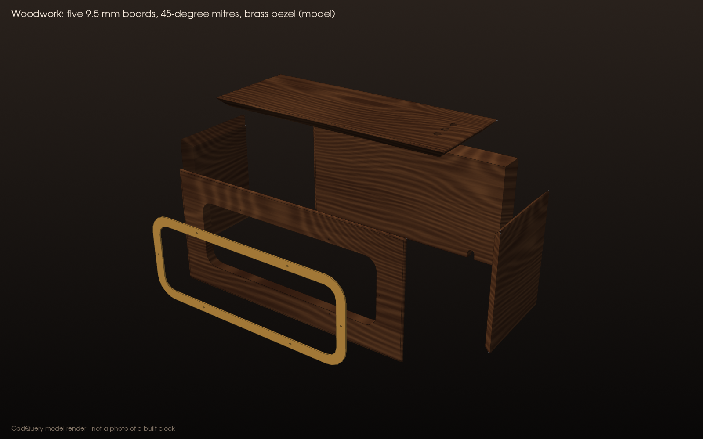

# Woodwork and brass

The heirloom look comes from five hardwood boards mitred into a box, a brass bezel around the window, brass feet and brass button caps. None of this is electrical, and none of it carries a precise fit: the printed inner case does that, so the woodwork can be forgiving. Everything here is a **baseline, untested** plan, like the rest of Rev C.

> [!WARNING]
> **Do all woodwork and brass work before any electronics go near the case.** Brass swarf and filings are conductive: one chip near a 170 V trace is a short. Vacuum the inner case and the wood box before assembly. Walnut dust irritates skin and airways: wear a dust mask and extract dust.

## What you make

| Part | Outer size (mm) | Joints | From |
|---|---|---|---|
| 08 front | 254 × 121.5 × 9.5 | 45° mitre on both ends and the top edge; window opening 198 × 68, R12 | `cad/dxf/Wood_boards_1to1.dxf` |
| 09 back | 254 × 121.5 × 9.5 | Mitre both ends and the top; cable notch 8 × 10 in the bottom edge | same |
| 10, 11 ends | 100 × 121.5 × 9.5 | Mitre both vertical edges and the top | same |
| 12 top | 254 × 100 × 9.5 | Mitre all four edges; 3 holes Ø8; 4 pilots Ø1.6 × 6.5 deep from below | same |
| 13 brass bezel | 214 × 84 × 1 | 6 holes Ø2.4 | `cad/dxf/Brass_bezel_1mm_1to1.dxf` |
| 14 brass feet × 4 | Ø14 × 8 | Hole Ø2.4, counterbore Ø4.2 × 2.2, 1 mm chamfer | `cad/step/14_brass_foot.step` |

Sizes are the **outer faces** of the mitred boards; grain runs along the long side of each board. The finished box is 254 × 100 × 121.5 mm, 129.5 mm tall on its feet, and weighs about 530 g in walnut. STEP models of every board are in `cad/step/08_…` to `12_…`.

## Wood

- **Black walnut** is the default. Oak, cherry and ash work too; avoid soft, resinous woods.
- Buy one board **planed to 9.5 mm, 130 mm wide and about 1.1 m long**. Let it sit indoors for a week first.
- Cut the four sides from one length, in order **front · right end · back · left end**, so the grain wraps continuously round the corners. The top comes from what is left.

## Steps

1. **Print the inner case first.** It is the gauge for everything that follows.
2. **Cut the boards** about 1 mm long, then mitre them at exactly 45° on a table saw with a sled, a mitre saw, or a mitre box and shooting board. Test the angle on offcuts: four test pieces must close into a square with no gap.
3. **Window opening** in the front: drill a 10 mm hole inside each corner, saw between them with a coping, scroll or jig saw, and file to the line. Or send the front DXF to a CNC or laser service. The cut edge is hidden behind the brass bezel, so it does not need to be perfect.
4. **Cable notch** in the bottom edge of the back, 8 mm wide and 10 mm high, centred 40 mm from the right-hand end as seen from the front.
5. **Glue-up (tape-hinge method).** Lay the four sides face down in order, ends touching, and tape across each joint. Wrap the inner case in cling film (so glue cannot stick to it), spread PVA glue on the mitres, roll the boards up round the inner case and tape the last joint. Then glue the top on, again with the wrapped inner case inside as the form, and tape or clamp it. Wipe squeeze-out with a damp cloth.
6. **Holes in the top, drilled through the inner case so they line up.** With the glue dry, put the inner case (film off) into the box. From inside, drill each of the four roof holes with a **1.6 mm** bit set to stop 9.5 mm past the inside of the roof (3 mm roof + 6.5 mm into the wood): it must **not** break through the top. Then drill a 6 mm pilot up through each of the three button guides, take the inner case out, and open those three holes to 8 mm from outside.
7. **Round over** every outer edge to about R3 with a 3 mm roundover bit or a sanding block. Sand 120 → 180 → 240, wipe with a damp cloth to raise the grain, then 320.
8. **Finish** the outside with two or three coats of hardwax or Danish oil, then paste wax. Leave the inside faces bare or give them one coat; keep finish out of the screw pilots.
9. **Brass bezel.** Have the DXF cut by a laser or waterjet service, or cut it from 1 mm sheet with a fret saw and files. Deburr, then brush in one direction with a fine abrasive pad (or polish), degrease and clear-lacquer it, or leave it to patina. Centre it on the window, mark the six holes, drill 1.6 mm pilots 6.5 mm deep, cut each thread with a **steel** M2 × 6 first, then drive the **waxed brass** M2 × 6 pan-head screws. Brass screws snap easily in walnut.
10. **Brass feet.** Cut four 8 mm slices from 14 mm brass bar, face them flat, drill 2.4 mm through the centre, counterbore 4.2 mm × 2.2 mm deep on the bottom face, chamfer the bottom edge, and polish. No lathe? Print part 14 in silk brass instead.
11. **Button rods.** Print part 04 in silk brass, or turn them from brass (6 mm shaft, 10.5 mm cap, 96.5 mm overall, 4.2 mm × 2 mm cup in the bottom). Solid brass rods weigh about 0.24 N each, still well under the switches' 1.47 N actuation force.
12. **Fit the box.** Vacuum everything. Slip the box over the inner case and drive 4 × M2 × 8 up through the roof into the pilots. The wood is never glued to the inner case, so it can come off again.

**PASS / FIX / STOP** for this work is in the [build guide](BUILD_GUIDE.md#woodwork-and-brass-no-electronics-any-time).

## Why the wood is cladding, not the enclosure

- **Precision lives in the print.** The window slot, the button guides and the screw blocks are printed to tenths of a millimetre; wood moves with the seasons. A 0.5 mm gap on every side lets it.
- **High voltage stays inside the printed case.** The wood never touches the circuit board, the tubes or any HV part, and the case is never run with only the wood around it.
- **Combustibility.** Wood and PETG both burn; no flammability rating is claimed for either. The anode-resistor fault power in [VALIDATION.md](VALIDATION.md#open-items) is an open item for the same reason.
- **Heat.** The wood adds insulation. With it, the modelled average rise inside the sealed case is about 3–5 K ([EQUATIONS.md](EQUATIONS.md#7-sealed-case-temperature)); Stage 5 of the build guide measures the hot spots with the box on.
